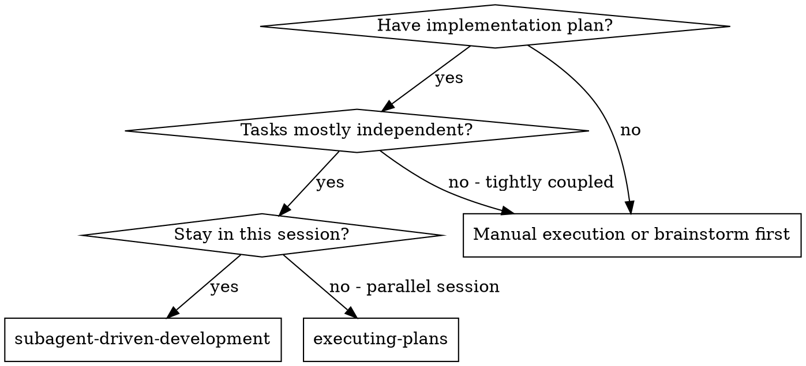
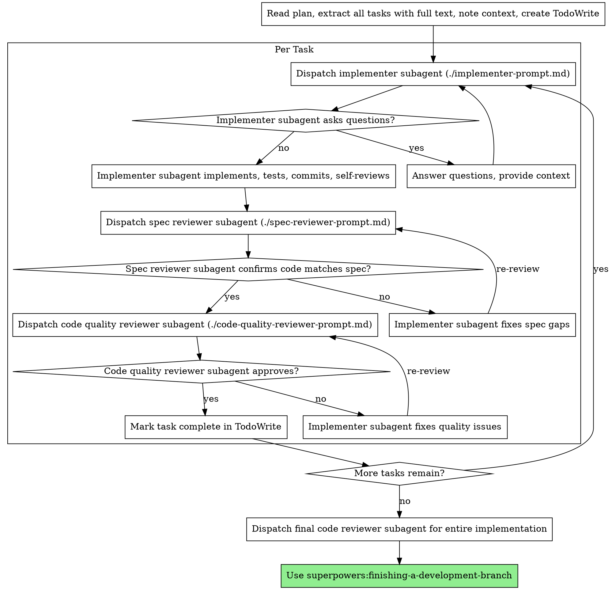

# 子代理驱动的开发

通过为每个任务派遣新的子代理来执行计划，每个任务之后进行两阶段审查：首先进行规范合规性审查，然后进行代码质量审查。

**为什么使用子代理：** 您可以将任务委托给具有隔离上下文的专门代理。通过精确地制定他们的指示和背景，您可以确保他们保持专注并成功完成任务。他们永远不应该继承你的会话的上下文或历史——你构建的正是他们所需要的。这也保留了您自己的协调工作环境。

**核心原则：** 每个任务新鲜的子代理+两阶段审查（规格然后质量）=高质量，快速迭代

**持续执行：** 在任务之间不要停下来与您的人类合作伙伴核对。不间断地执行计划中的所有任务。停止的唯一原因是：无法解决的“阻塞”状态、真正阻碍进度的歧义或所有任务已完成。 “我应该继续吗？”提示和进度总结浪费了他们的时间——他们要求你执行计划，所以执行它。

## 何时使用



**与。执行计划（平行会议）：**
- 同一会话（无上下文切换）
- 每个任务都有新的子代理（无上下文污染）
- 每项任务后进行两阶段审查：首先是规范合规性，然后是代码质量
- 更快的迭代（任务之间没有人在循环）

## 过程



## 选型

使用可以处理每个角色的功能最弱的模型来节省成本并提高速度。

**机械实现任务**（独立的功能、清晰的规格、1-2 个文件）：使用快速、廉价的模型。当计划明确时，大多数实施任务都是机械的。

**集成判断任务**（多文件协调、模式匹配、调试）：使用标准模型。

**架构、设计和审查任务**：使用功能最强大的可用模型。

**Task 复杂性信号：**
- 涉及 1-2 个具有完整规格的文件 → 廉价型号
- 涉及具有集成问题的多个文件 → 标准模型
- 需要设计判断或广泛的代码库理解→最有能力的模型

## 处理实施者状态

实施者子代理报告四种状态之一。妥善处理每一项：

**完成：** 继续进行规范合规性审查。

**DONE_WITH_CONCERNS：** 实施者完成了工作，但提出了疑问。 Read 继续之前的问题。如果问题涉及正确性或范围，请在审核之前解决它们。如果它们是观察结果（例如，“这个文件变得很大”），请记下它们并继续进行审查。

**NEEDS_CONTEXT：** 实施者需要未提供的信息。提供缺失的上下文并重新调度。

**被阻止：** 实施者无法完成任务。评估拦截器：
1. 如果是上下文问题，请提供更多上下文并使用相同模型重新调度
2. 如果任务需要更多推理，请使用更强大的模型重新调度
3. 如果任务太大，请将其分解为较小的部分
4. 如果计划本身错误，请升级至人工

**永远不要**忽略升级或强制同一模型在不进行更改的情况下重试。如果实施者说它被卡住了，那么有些事情需要改变。

## 提示模板

- `./implementer-prompt.md` - 调度实施者子代理
- `./spec-reviewer-prompt.md` - 派遣规范合规性审核员子代理
- `./code-quality-reviewer-prompt.md` - 派遣代码质量审核员子代理

## 示例工作流程

```
You: I'm using Subagent-Driven Development to execute this plan.

[Read plan file once: docs/superpowers/plans/feature-plan.md]
[Extract all 5 tasks with full text and context]
[Create TodoWrite with all tasks]

Task 1: Hook installation script

[Get Task 1 text and context (already extracted)]
[Dispatch implementation subagent with full task text + context]

Implementer: "Before I begin - should the hook be installed at user or system level?"

You: "User level (~/.config/superpowers/hooks/)"

Implementer: "Got it. Implementing now..."
[Later] Implementer:
  - Implemented install-hook command
  - Added tests, 5/5 passing
  - Self-review: Found I missed --force flag, added it
  - Committed

[Dispatch spec compliance reviewer]
Spec reviewer: ✅ Spec compliant - all requirements met, nothing extra

[Get git SHAs, dispatch code quality reviewer]
Code reviewer: Strengths: Good test coverage, clean. Issues: None. Approved.

[Mark Task 1 complete]

Task 2: Recovery modes

[Get Task 2 text and context (already extracted)]
[Dispatch implementation subagent with full task text + context]

Implementer: [No questions, proceeds]
Implementer:
  - Added verify/repair modes
  - 8/8 tests passing
  - Self-review: All good
  - Committed

[Dispatch spec compliance reviewer]
Spec reviewer: ❌ Issues:
  - Missing: Progress reporting (spec says "report every 100 items")
  - Extra: Added --json flag (not requested)

[Implementer fixes issues]
Implementer: Removed --json flag, added progress reporting

[Spec reviewer reviews again]
Spec reviewer: ✅ Spec compliant now

[Dispatch code quality reviewer]
Code reviewer: Strengths: Solid. Issues (Important): Magic number (100)

[Implementer fixes]
Implementer: Extracted PROGRESS_INTERVAL constant

[Code reviewer reviews again]
Code reviewer: ✅ Approved

[Mark Task 2 complete]

...

[After all tasks]
[Dispatch final code-reviewer]
Final reviewer: All requirements met, ready to merge

Done!
```

## 优点

**与。手动执行：**
- 子代理自然地遵循 TDD
- 每个任务都有新鲜的背景（没有混淆）
- 并行安全（子代理不干扰）
- 子代理可以提问（工作之前和工作期间）

**与。执行计划：**
- 同一会话（无切换）
- 持续进步（无需等待）
- 自动审查检查点

**效率提升：**
- 无文件读取开销（控制器提供全文）
- 控制器准确地策划所需的上下文
- 子代理预先获取完整信息
- 问题在工作开始之前（而不是之后）出现

**质量门：**
- 移交前自我审查发现问题
- 两阶段审查：规范合规性，然后是代码质量
- 审查循环确保修复确实有效
- 规范合规性可防止 over/under-building
- 代码质量确保实施良好

**成本：**
- 更多子代理调用（每个任务的实施者 + 2 个审阅者）
- 控制器做更多的准备工作（预先提取所有任务）
- 审查循环添加迭代
- 但尽早发现问题（比稍后调试便宜）

## 危险信号

**绝不：**
- 在未经用户明确同意的情况下开始在 main/master 分支上实施
- 跳过审查（规范合规性或代码质量）
- 继续处理未解决的问题
- 并行调度多个实施子代理（冲突）
- 让子代理读取计划文件（改为提供全文）
- 跳过场景设置上下文（子代理需要了解任务适合的位置）
- 忽略子代理问题（在继续之前回答）
- 接受规范合规性“足够接近”（规范审核者发现问题=未完成）
- 跳过审核循环（审核者发现问题 = 实施者修复 = 再次审核）
- 让实施者自我审查代替实际审查（两者都需要）
- **在规范合规性为✅**之前开始代码质量审查（顺序错误）
- 当任一审核有未解决的问题时移至下一个任务

**如果子代理提出问题：**
- 回答清楚、完整
- 如果需要，提供额外的上下文
- 不要急于实施

**如果审阅者发现问题：**
- 实施者（同一子代理）修复它们
- 审稿人再次审稿
- 重复直至获得批准
- 不要跳过重新审核

**如果子代理任务失败：**
- 调度带有特定说明的修复子代理
- 不要尝试手动修复（上下文污染）

## 一体化

**所需的工作流程技能：**
- **超级能力：使用-git-worktrees** - 确保隔离的工作区（创建一个或验证现有的）
- **superpowers:writing-plans** - 创建该技能执行的计划
- **superpowers:requesting-code-review** - 审阅者子代理的代码审阅模板
- **超级大国：完成开发分支** - 在完成所有任务后完成开发

**子代理应使用：**
- **超级能力：测试驱动开发** - 子代理遵循 TDD 执行每项任务

**替代工作流程：**
- **superpowers:executing-plans** - 用于并行会话而不是同一会话执行
