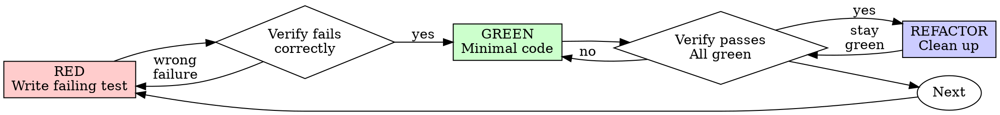

# 测试驱动开发 (TDD)

## 概述

Write 首先测试。看着它失败。 Write 要传递的最少代码。

**核心原则：** 如果你没有看到测试失败，你就不知道它是否测试了正确的东西。

**违反规则的字面意思就是违反规则的精神。**

## 何时使用

**总是：**
- 新功能
- 错误修复
- 重构
- 行为改变

**例外（询问你的人类伙伴）：**
- 一次性原型
- 生成的代码
- 配置文件

想“跳过 TDD 这一次”吗？停止。这就是合理化。

## 铁律

```
NO PRODUCTION CODE WITHOUT A FAILING TEST FIRST
```

Write 测试前的代码？删除它。重新开始。

**没有例外：**
- 不要将其保留为“参考”
- 编写测试时不要“适应”它
- 别看它
- 删除就是删除

实施新的测试。时期。

## 红绿重构



### 红色 - Write 测试失败

Write 一个最小的测试，显示应该发生什么。

<Good>
```typescript
test('retries failed operations 3 times', async () => {
  let attempts = 0;
  const operation = () => {
    attempts++;
    if (attempts < 3) throw new Error('fail');
    return 'success';
  };

  const result = await retryOperation(operation);

  expect(result).toBe('success');
  expect(attempts).toBe(3);
});
```
清晰的名字，测试真实的行为，一件事
</Good>

<Bad>
```typescript
test('retry works', async () => {
  const mock = jest.fn()
    .mockRejectedValueOnce(new Error())
    .mockRejectedValueOnce(new Error())
    .mockResolvedValueOnce('success');
  await retryOperation(mock);
  expect(mock).toHaveBeenCalledTimes(3);
});
```
模糊的名称，测试模拟而不是代码
</Bad>

**要求：**
- 一种行为
- 清晰的名字
- 真实代码（除非不可避免，否则不进行模拟）

### 验证红色 - 观察失败

**强制的。切勿跳过。**

```bash
npm test path/to/test.test.ts
```

确认：
- 测试失败（不是错误）
- 预计会出现失败消息
- 由于功能缺失（不是拼写错误）而失败

**测试通过？** 您正在测试现有行为。修复测试。

**测试错误？** 修复错误，重新运行，直到正确失败。

### 绿色 - 最少代码

Write 通过测试的最简单代码。

<Good>
```typescript
async function retryOperation<T>(fn: () => Promise<T>): Promise<T> {
  for (let i = 0; i < 3; i++) {
    try {
      return await fn();
    } catch (e) {
      if (i === 2) throw e;
    }
  }
  throw new Error('unreachable');
}
```
只要够通过即可
</Good>

<Bad>
```typescript
async function retryOperation<T>(
  fn: () => Promise<T>,
  options?: {
    maxRetries?: number;
    backoff?: 'linear' | 'exponential';
    onRetry?: (attempt: number) => void;
  }
): Promise<T> {
  // YAGNI
}
```
过度设计
</Bad>

不要添加功能、重构其他代码或在测试之外进行“改进”。

### 验证绿色 - 观察它通过

**强制的。**

```bash
npm test path/to/test.test.ts
```

确认：
- 测试通过
- 其他测试仍然通过
- 输出原始（没有错误、警告）

**测试失败？** 修复代码，而不是测试。

**其他测试失败？** 立即修复。

### 重构 - 清理

仅绿色之后：
- 删除重复项
- 改进名字
- 提取助手

保持测试绿色。不要添加行为。

### 重复

下一个功能的下一个失败测试。

## 良好的测试

|品质 |好 |坏|
|---------|------|-----|
| **最小** |一件事。名字中的“和”？分开它。 | `test('validates email and domain and whitespace')` |
| **清除** |名称描述行为 | `test('test1')` |
| **表明意图** |演示所需的 API |模糊了代码应该做什么 |

## 为什么订单很重要

**“我会在之后编写测试来验证它是否有效”**

代码通过后编写的测试立即通过。立即通过并不能证明什么：
- 可能测试错误的东西
- 可能测试实施，而不是行为
- 可能会错过您忘记的边缘情况
- 你从未见过它捕获 bug

测试优先迫使您看到测试失败，证明它确实测试了某些东西。

**“我已经手动测试了所有边缘情况”**

手动测试是临时的。您认为您测试了所有内容，但：
- 没有记录您测试的内容
- 代码更改后无法重新运行
- 在压力下容易忘记案件
- “我尝试了一下就成功了”≠全面

自动化测试是系统化的。他们每次都以同样的方式奔跑。

**“删除 X 小时的工作是浪费”**

沉没成本谬误。时间已经过去了。您现在的选择：
- 使用 TDD 删除并重写（多花几个小时，高可信度）
- 保留它并在之后添加测试（30 分钟，低置信度，可能存在错误）

“浪费”是保留你不信任的代码。没有真正测试的工作代码是技术债务。

**“TDD 是教条主义的，务实意味着适应”**

TDD 很务实：
- 在提交之前发现错误（比之后调试更快）
- 防止回归（测试立即捕获中断）
- 文档行为（测试显示如何使用代码）
- 启用重构（自由更改，测试捕获中断）

“实用”快捷方式=生产中的调试=速度较慢。

**“达到相同目标后进行测试 - 这是精神而不是仪式”**

不。回答后测试“这有什么作用？”测试优先回答“这应该做什么？”

之后的测试因您的实现而存在偏差。您测试您构建的内容，而不是测试所需的内容。您验证记住的边缘情况，而不是发现的情况。

测试优先强制在实施之前发现边缘情况。测试 - 验证您记住了所有内容（您没有记住）。

≠ TDD 之后 30 分钟的测试。你得到了保险，失去了证明测试的工作。

## 常见的合理化理由

|对不起|现实|
|--------|---------|
| “太简单了，无法测试”|简单的代码中断。测试需要 30 秒。 |
| “之后我会测试”|测试立即通过并不能证明什么。 |
| “达到相同目标后进行测试”| Tests-after =“这是做什么的？”测试优先=“这应该做什么？” |
| “已经手动测试”|临时性≠系统性。没有记录，无法重新运行。 |
| “删除 X 小时是浪费”|沉没成本谬误。保留未经验证的代码是技术债。 |
| “留作参考，先写测试” |你会适应它。后面就是测试了删除就是删除的意思。 |
| “需要先探索”|美好的。放弃探索，从 TDD 开始。 |
| “努力测试=设计不清楚”|听听测试。难以测试=难以使用。 |
| “TDD 会让我放慢速度” | TDD 比调试更快。务实=测试第一。 |
| “手动测试速度更快”|手册不能证明边缘情况。您将重新测试每个更改。 |
| “现有代码没有经过测试”|你正在改进它。为现有代码添加测试。 |

## 危险信号 - 停止并重新开始

- 测试前的代码
- 实施后测试
- 测试立即通过
- 无法解释测试失败的原因
- “稍后”添加测试
- 合理化“就这一次”
- “我已经手动测试过了”
- “达到相同目的后进行测试”
- “这是关于精神而不是仪式”
- “保留作为参考”或“改编现有代码”
- “已经花了X个小时了，删除太浪费了”
- “TDD 很教条，我很务实”
- “这是不同的，因为……”

**所有这些意味着：删除代码。从 TDD 开始。**

## 示例：错误修复

**错误：** 接受空电子邮件

**红色的**
```typescript
test('rejects empty email', async () => {
  const result = await submitForm({ email: '' });
  expect(result.error).toBe('Email required');
});
```

**验证红色**
```bash
$ npm test
FAIL: expected 'Email required', got undefined
```

**绿色的**
```typescript
function submitForm(data: FormData) {
  if (!data.email?.trim()) {
    return { error: 'Email required' };
  }
  // ...
}
```

**验证绿色**
```bash
$ npm test
PASS
```

**重构**
如果需要，提取多个字段的验证。

## 验证清单

在标记工作完成之前：

- [ ] 每个新function/method都有一个测试
- [ ] 在实施之前观察每个测试的失败
- [ ] 每个测试均因预期原因而失败（功能缺失，而非拼写错误）
- [ ] 编写最少的代码来通过每个测试
- [ ] 所有测试均通过
- [ ] 输出原始（没有错误、警告）
- [ ] 测试使用真实代码（仅在不可避免时才进行模拟）
- [ ] 涵盖的边缘情况和错误

无法选中所有框吗？你跳过了 TDD。重新开始。

## 卡住时

|问题 |解决方案 |
|---------|----------|
|不知道如何测试 | Write 想要的 API。 Write 首先断言。询问你的人类伴侣。 |
|测试太复杂|设计太复杂了。简化界面。 |
|必须嘲笑一切|代码耦合性太强。使用依赖注入。 |
|测试设置巨大|提取助手。还是很复杂？简化设计。 |

## 调试集成

发现错误了吗？ Write 未能通过测试重现它。遵循 TDD 周期。测试证明可以修复并防止回归。

未经测试切勿修复错误。

## 测试反模式

添加模拟或测试实用程序时，请阅读 @testing-anti-patterns.md 以避免常见陷阱：
- 测试模拟行为而不是真实行为
- 将仅测试方法添加到生产类中
- 在不了解依赖关系的情况下进行模拟

## 最终规则

```
Production code → test exists and failed first
Otherwise → not TDD
```

未经您的人类伴侣许可，也不例外。
