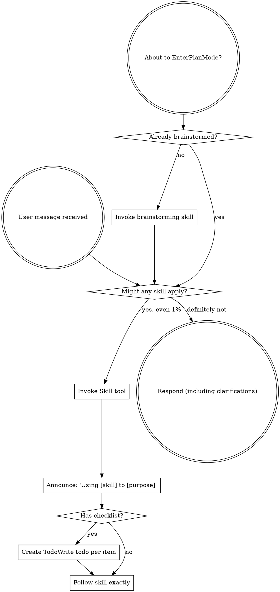

<SUBAGENT-STOP>
如果您被派遣为子代理来执行特定任务，请跳过此技能。
</SUBAGENT-STOP>

<EXTREMELY-IMPORTANT>
如果您认为某项技能有 1% 的机会适用于您正在做的事情，那么您绝对必须调用该技能。

如果某项技能适用于您的任务，您就别无选择。你必须使用它。

这是没有商量余地的。这不是可选的。你无法合理化自己的出路。
</EXTREMELY-IMPORTANT>

## 指令优先级

超能力技能会覆盖默认的系统提示行为，但**用户指令始终优先**：

1. **用户的明确指示**（CLAUDE.md、GEMINI.md、AGENTS.md、直接请求）- 最高优先级
2. **超能力技能** — 覆盖它们冲突的默认系统行为
3. **默认系统提示** — 最低优先级

如果 CLAUDE.md、GEMINI.md 或 AGENTS.md 表示“不要使用 TDD”，而技能表示“始终使用 TDD”，请按照用户的说明进行操作。用户处于控制之中。

## 如何获取技能

**在克劳德代码中：** 使用`Skill` 工具。当您调用一项技能时，其内容将被加载并呈现给您 - 直接遵循它。切勿对技能文件使用Read 工具。

**在 Copilot CLI 中：** 使用 `skill` 工具。技能是从安装的插件中​​自动发现的。 `skill` 工具的工作原理与 Claude Code 的 `Skill` 工具相同。

**在 Gemini CLI 中：** 通过 `activate_skill` 工具激活技能。 Gemini 在会话开始时加载技能元数据并按需激活完整内容。

**在其他环境中：** 检查您的平台文档以了解如何加载技能。

## 平台适配

技能使用 Claude Code 工具名称。非 CC 平台：请参阅 `references/copilot-tools.md` (Copilot CLI)、`references/codex-tools.md` (Codex) 了解等效工具。 Gemini CLI 用户通过 GEMINI.md 自动加载工具映射。

# 使用技巧

## 规则

**在任何响应或操作之前调用相关或请求的技能。** 即使某项技能适用的可能性只有 1%，也意味着您应该调用该技能进行检查。如果调用的技能被证明不适合当前情况，则您不需要使用它。

## 危险信号

这些想法意味着停止——你正在合理化：

|思想|现实|
|---------|---------|
| “这只是一个简单的问题”|问题就是任务。检查技能。 |
| “我首先需要更多背景信息” |技能检查先于澄清问题。 |
| “让我先探索一下代码库”|技能告诉您如何探索。先检查一下。 |
| “我可以快速查看git/files” |文件缺乏对话上下文。检查技能。 |
| “我先收集一下信息”|技能告诉您如何收集信息。 |
| “这不需要正式的技能” |如果存在技能，就使用它。 |
| “我记得这个技能”|技能不断发展。 Read当前版本。 |
| “这不算是任务”|行动=任务。检查技能。 |
| “技能太过分了”|简单的事情变得复杂。使用它。 |
| “我先做一件事” |做任何事情之前先检查一下。 |
| “这感觉很有成效” |无纪律的行动会浪费时间。技能可以防止这种情况发生。 |
| “我知道这意味着什么” |了解概念≠使用技能。调用它。 |

## 技能优先

当可以应用多种技能时，请使用以下顺序：

1. **首先是流程技能**（头脑风暴、调试）——这些决定了如何处理任务
2. **实施技巧第二**（前端设计、mcp-builder）-这些指导执行

“让我们构建X”→首先集思广益，然后是实施技巧。
“修复此错误”→ 首先调试，然后再进行特定领域的技能。

## 技能类型

**严格**（TDD、调试）：严格遵循。不要适应纪律。

**灵活**（模式）：根据具体情况调整原则。

技能本身会告诉你哪个。

## 用户说明

说明说的是“做什么”，而不是“如何做”。 “添加 X”或“修复 Y”并不意味着跳过工作流程。
