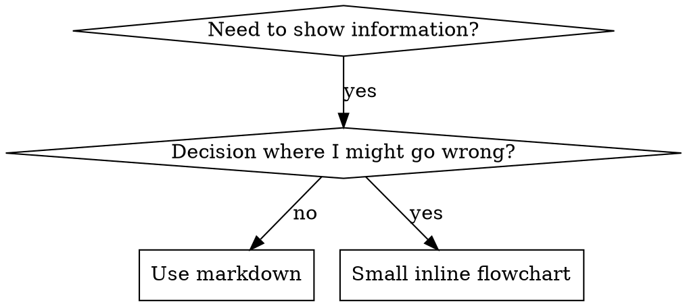

# 写作技巧

## 概述

**写作技巧是将测试驱动开发应用于流程文档。**

**个人技能位于特工特定目录中（`~/.claude/skills` 用于 Claude Code，`~/.agents/skills/` 用于 Codex）**

您编写测试用例（子代理的压力场景），观察它们失败（基线行为），编写技能（文档），观察测试通过（代理遵守），然后重构（关闭漏洞）。

**核心原则：** 如果你没有看到代理在没有技能的情况下失败，你就不知道该技能是否教授了正确的东西。

**所需背景：** 在使用此技能之前，您必须了解超能力：测试驱动开发。该技能定义了基本的红-绿-重构循环。该技能使 TDD 适应文档。

**官方指导：** Anthropic 的官方技能创作最佳实践，请参阅anthropic-best-practices.md。本文档提供了额外的模式和指南，以补充该技能中以 TDD 为中心的方法。

## 什么是技能？

**技能**是经过验证的技术、模式或工具的参考指南。技能帮助未来的克劳德实例找到并应用有效的方法。

**技能是：** 可重复使用的技术、模式、工具、参考指南

**技能不是：** 关于您如何解决一次问题的叙述

## TDD 技能映射

| TDD 概念 |技能创造|
|-------------|----------------|
| **测试用例** |带有子代理的压力场景|
| **生产代码** |技能文档(SKILL.md) |
| **测试失败（红色）** |代理在没有技能的情况下违反规则（基线）|
| **测试通过（绿色）** |代理人遵守现有技能 |
| **重构** |堵住漏洞，同时保持合规性 |
| **Write 首先测试** |在编写技能之前运行基线场景 |
| **看着它失败** |记录代理使用的准确合理化|
| **最少代码** | Write 处理这些具体违规行为的技能 |
| **看着它过去** |验证代理现在是否符合要求 |
| **重构周期** |寻找新的合理化→堵塞→重新验证|

整个技能创建过程遵循红-绿-重构。

## 何时创建技能

**创建时间：**
- 技术对你来说并不直观明显
- 您可以在项目中再次引用它
- 模式适用范围广泛（不特定于项目）
- 其他人会受益

**不要为以下目的创建：**
- 一次性解决方案
- 其他地方有详细记录的标准实践
- 项目特定约定（放入CLAUDE.md）
- 机械约束（如果可以通过 regex/validation 强制执行，则将其自动化 - 保存判断调用的文档）

## 技能类型

### 技术
具体方法和步骤（基于条件的等待、根本原因追踪）

### 图案
思考问题的方式（带标志的扁平化、测试不变量）

### 参考
API文档、语法指南、工具文档（office文档）

## 目录结构


```
skills/
  skill-name/
    SKILL.md              # Main reference (required)
    supporting-file.*     # Only if needed
```

**扁平命名空间** - 所有技能都集中在一个可搜索命名空间中

**单独的文件：**
1. **大量参考**（100 多行）- API 文档，全面的语法
2. **可重用工具** - 脚本、实用程序、模板

**保持内联：**
- 原理和概念
- 代码模式（< 50 行）
- 其他一切

## SKILL.md结构

**前端问题 (YAML)：**
- 两个必填字段：`name` 和 `description`（有关所有支持的字段，请参阅 [agentskills.io/specification](https://agentskills.io/specification)）
- 总共最多 1024 个字符
- `name`：仅使用字母、数字和连字符（无括号、特殊字符）
- `description`：第三人称，仅描述何时使用（而不是它的作用）
  - 从“Use when...”开始，重点关注触发条件
  - 包括具体症状、情况和背景
  - **永远不要总结技能的流程或工作流程**（请参阅 CSO 部分了解原因）
  - 尽可能保持在 500 个字符以内

```markdown
---
name: Skill-Name-With-Hyphens
description: Use when [specific triggering conditions and symptoms]
---

# Skill Name

## Overview
What is this? Core principle in 1-2 sentences.

## When to Use
[Small inline flowchart IF decision non-obvious]

Bullet list with SYMPTOMS and use cases
When NOT to use

## Core Pattern (for techniques/patterns)
Before/after code comparison

## Quick Reference
Table or bullets for scanning common operations

## Implementation
Inline code for simple patterns
Link to file for heavy reference or reusable tools

## Common Mistakes
What goes wrong + fixes

## Real-World Impact (optional)
Concrete results
```


## 克劳德搜索优化 (CSO)

**发现的关键：**未来的克劳德需要找到你的技能

### 1. 丰富的描述字段

**目的：** 克劳德阅读描述来决定为给定任务加载哪些技能。让它回答：“我现在应该读这个技能吗？”

**格式：** 以“Use when...”开头，重点关注触发条件

**关键：描述=何时使用，而不是技能的用途**

描述应仅描述触发条件。不要在描述中总结技能的流程或工作流程。

**为什么这很重要：** 测试显示，当描述总结了技能的工作流程时，克劳德可能会遵循描述而不是阅读完整的技能内容。尽管该技能的流程图清楚地显示了两次审查（规范合规性然后是代码质量），但“任务之间的代码审查”的描述导致克劳德进行了一次审查。

当描述改为“在执行具有独立任务的实施计划时使用”（没有工作流程摘要）时，克劳德正确地阅读了流程图并遵循了两阶段审核流程。

**陷阱：** 总结工作流程的描述创建了克劳德将采取的捷径。技能主体变成了克劳德跳过的文档。

```yaml
# ❌ BAD: Summarizes workflow - Claude may follow this instead of reading skill
description: Use when executing plans - dispatches subagent per task with code review between tasks

# ❌ BAD: Too much process detail
description: Use for TDD - write test first, watch it fail, write minimal code, refactor

# ✅ GOOD: Just triggering conditions, no workflow summary
description: Use when executing implementation plans with independent tasks in the current session

# ✅ GOOD: Triggering conditions only
description: Use when implementing any feature or bugfix, before writing implementation code
```

**内容：**
- 使用表明该技能适用的具体触发因素、症状和情况
- 描述*问题*（竞争条件、不一致的行为）而不是*特定于语言的症状*（setTimeout、睡眠）
- 保持触发器与技术无关，除非技能本身是特定于技术的
- 如果技能是特定于技术的，请在触发器中明确说明
- Write 第三人称（注入系统提示符）
- **永远不要总结技能的流程或工作流程**

```yaml
# ❌ BAD: Too abstract, vague, doesn't include when to use
description: For async testing

# ❌ BAD: First person
description: I can help you with async tests when they're flaky

# ❌ BAD: Mentions technology but skill isn't specific to it
description: Use when tests use setTimeout/sleep and are flaky

# ✅ GOOD: Starts with "Use when", describes problem, no workflow
description: Use when tests have race conditions, timing dependencies, or pass/fail inconsistently

# ✅ GOOD: Technology-specific skill with explicit trigger
description: Use when using React Router and handling authentication redirects
```

### 2. 关键词覆盖率

使用克劳德会搜索的词：
- 错误消息：“挂钩超时”、“ENOTEMPTY”、“竞争条件”
- 症状：“片状”、“悬挂”、“僵尸”、“污染”
- 同义词：“timeout/hang/freeze”、“cleanup/teardown/afterEach”
- 工具：实际命令、库名称、文件类型

### 3. 描述性命名

**使用主动语态，动词在前：**
- ✅ `creating-skills` 不是`skill-creation`
- ✅ `condition-based-waiting` 不是`async-test-helpers`

### 4. 代币效率（关键）

**问题：**每次对话中都会包含入门和经常引用的技能。每个令牌都很重要。

**目标字数：**
- 入门工作流程：每个 <150 字
- 常用技能：总字数<200
- 其他技能：<500字（仍要简洁）

**技术：**

**将详细信息移至工具帮助：**
```bash
# ❌ BAD: Document all flags in SKILL.md
search-conversations supports --text, --both, --after DATE, --before DATE, --limit N

# ✅ GOOD: Reference --help
search-conversations supports multiple modes and filters. Run --help for details.
```

**使用交叉引用：**
```markdown
# ❌ BAD: Repeat workflow details
When searching, dispatch subagent with template...
[20 lines of repeated instructions]

# ✅ GOOD: Reference other skill
Always use subagents (50-100x context savings). REQUIRED: Use [other-skill-name] for workflow.
```

**压缩示例：**
```markdown
# ❌ BAD: Verbose example (42 words)
your human partner: "How did we handle authentication errors in React Router before?"
You: I'll search past conversations for React Router authentication patterns.
[Dispatch subagent with search query: "React Router authentication error handling 401"]

# ✅ GOOD: Minimal example (20 words)
Partner: "How did we handle auth errors in React Router?"
You: Searching...
[Dispatch subagent → synthesis]
```

**消除冗余：**
- 不要重复交叉引用技能中的内容
- 不要解释从命令中显而易见的内容
- 请勿包含同一模式的多个示例

**确认：**
```bash
wc -w skills/path/SKILL.md
# getting-started workflows: aim for <150 each
# Other frequently-loaded: aim for <200 total
```

**根据您所做的事情或核心见解来命名：**
- ✅ `condition-based-waiting` > `async-test-helpers`
- ✅ `using-skills` 不是`skill-usage`
- ✅ `flatten-with-flags` > `data-structure-refactoring`
- ✅ `root-cause-tracing` > `debugging-techniques`

**动名词 (-ing) 适用于流程：**
- `creating-skills`、`testing-skills`、`debugging-with-logs`
- 活跃，描述您正在采取的行动

### 4. 交叉参考其他技能

**在编写引用其他技能的文档时：**

仅使用技能名称，并带有明确的要求标记：
- ✅ 好：`**REQUIRED SUB-SKILL:** Use superpowers:test-driven-development`
- ✅ 好：`**REQUIRED BACKGROUND:** You MUST understand superpowers:systematic-debugging`
- ❌ 不好：`See skills/testing/test-driven-development`（如果需要则不清楚）
- ❌ 坏：`@skills/testing/test-driven-development/SKILL.md`（强制负载，烧伤上下文）

**为什么没有 @ 链接：** `@` 语法立即强制加载文件，在需要它们之前消耗 200k+ 上下文。

## 流程图使用



**流程图仅用于：**
- 不明显的决策点
- 您可能会过早停止的处理循环
- “何时使用 A 与 B”决策

**切勿将流程图用于：**
- 参考资料 → 表格、列表
- 代码示例 → Markdown 块
- 线性指令 → 编号列表
- 无语义的标签（step1、helper2）

有关 graphviz 样式规则，请参阅@graphviz-conventions.dot。

**为您的人类伙伴进行可视化：** 使用此目录中的 `render-graphs.js` 将技能流程图渲染为 SVG：
```bash
./render-graphs.js ../some-skill           # Each diagram separately
./render-graphs.js ../some-skill --combine # All diagrams in one SVG
```

## 代码示例

**一个优秀的例子胜过许多平庸的例子**

选择最相关的语言：
- 测试技术 → TypeScript/JavaScript
- 系统调试→Shell/Python
- 数据处理 → Python

**好例子：**
- 完整且可运行
- 评论很好，解释了为什么
- 来自真实场景
- 清晰显示图案
- 准备好适应（不是通用模板）

**不：**
- 以 5 种以上语言实施
- 创建填空模板
- Write 人为的例子

你很擅长移植——一个很好的例子就足够了。

## 文件组织

### 自成一体的技能
```
defense-in-depth/
  SKILL.md    # Everything inline
```
时间：所有内容都合适，不需要大量参考

### 使用可重复使用工具的技能
```
condition-based-waiting/
  SKILL.md    # Overview + patterns
  example.ts  # Working helpers to adapt
```
何时：工具是可重用的代码，而不仅仅是叙述性的

### 具有大量参考的技能
```
pptx/
  SKILL.md       # Overview + workflows
  pptxgenjs.md   # 600 lines API reference
  ooxml.md       # 500 lines XML structure
  scripts/       # Executable tools
```
何时：参考资料对于内联来说太大

## 铁律（与 TDD 相同）

```
NO SKILL WITHOUT A FAILING TEST FIRST
```

这适用于新技能和对现有技能的编辑。

Write 测试前的技能？删除它。重新开始。
Edit 未经测试的技能？同样违规。

**没有例外：**
- 不适合“简单添加”
- 不是为了“只是添加一个部分”
- 不适用于“文档更新”
- 不要将未经测试的更改保留为“参考”
- 运行测试时不要“适应”
- 删除就是删除

**所需背景：** 超级能力：测试驱动开发技能解释了为什么这很重要。同样的原则也适用于文档。

## 测试所有技能类型

不同的技能类型需要不同的测试方法：

### 纪律执行技能 (rules/requirements)

**示例：** TDD、完成前验证、编码前设计

**测试用：**
- 学术问题：他们理解规则吗？
- 压力场景：他们在压力下服从吗？
- 多重压力叠加：时间+沉没成本+疲惫
- 识别合理化并添加显式计数器

**成功标准：** 特工在最大压力下遵循规则

### 技术技能（操作指南）

**示例：** 基于条件的等待、根本原因追踪、防御性编程

**测试用：**
- 应用场景：他们能正确应用该技术吗？
- 变化场景：它们是否处理边缘情况？
- 缺失信息测试：说明是否存在空白？

**成功标准：** 代理成功地将技术应用于新场景

### 模式技能（心智模型）

**示例：** 降低复杂性、信息隐藏概念

**测试用：**
- 识别场景：他们能识别模式何时应用吗？
- 应用场景：他们能使用心智模型吗？
- 反例：他们知道什么时候不应该申请吗？

**成功标准：** 代理正确识别when/how以应用模式

### 参考技能（documentation/APIs）

**示例：** API 文档、命令参考、库指南

**测试用：**
- 检索场景：他们能找到正确的信息吗？
- 应用场景：他们能正确使用他们发现的东西吗？
- 差距测试：是否涵盖常见用例？

**成功标准：** 代理找到并正确应用参考信息

## 跳过测试的常见理由

|对不起|现实|
|--------|---------|
| “功力明显清晰”|您清楚≠其他代理人清楚。测试一下。 |
| “这只是一个参考”|参考文献可能有空白、不清楚的部分。测试检索。 |
| “测试是矫枉过正”|未经测试的技能存在问题。总是。 15 分钟测试可节省数小时。 |
| “我会测试是否出现问题” |问题=特工无法使用技能。部署之前进行测试。 |
| “测试太繁琐” |测试比调试生产中的不良技能要简单得多。 |
| “我相信这很好” |过度自信会带来问题。无论如何都要测试一下。 |
| “学术评审就够了”|阅读≠使用。测试应用场景。 |
| “没有时间测试”|部署未经测试的技能会浪费更多时间来修复它。 |

**所有这些意味着：在部署之前进行测试。无一例外。**

## 反对合理化的防弹技巧

执行纪律的技能（如 TDD）需要抵制合理化。代理人很聪明，在压力下会发现漏洞。

**心理学注释：** 了解说服技巧为何有效可以帮助您系统地应用它们。有关权威、承诺、稀缺性、社会证明和团结原则的研究基金会（Cialdini，2021；Meincke 等人，2025）请参阅persuasion-principles.md。

### 明确堵住每一个漏洞

不要只是陈述规则 - 禁止特定的解决方法：

<坏>
```markdown
Write code before test? Delete it.
```
</坏>

<好>
```markdown
Write code before test? Delete it. Start over.

**No exceptions:**
- Don't keep it as "reference"
- Don't "adapt" it while writing tests
- Don't look at it
- Delete means delete
```
</好>

### 解决“精神与文字”的争论

尽早添加基本原则：

```markdown
**Violating the letter of the rules is violating the spirit of the rules.**
```

这切断了整个阶级的“我追随精神”的合理化。

### 建立合理化表

从基线测试中获取合理性（请参阅下面的测试部分）。代理人提出的每一个借口都在表中：

```markdown
| Excuse | Reality |
|--------|---------|
| "Too simple to test" | Simple code breaks. Test takes 30 seconds. |
| "I'll test after" | Tests passing immediately prove nothing. |
| "Tests after achieve same goals" | Tests-after = "what does this do?" Tests-first = "what should this do?" |
```

### 创建危险信号列表

让代理商在合理化时可以轻松自检：

```markdown
## Red Flags - STOP and Start Over

- Code before test
- "I already manually tested it"
- "Tests after achieve the same purpose"
- "It's about spirit not ritual"
- "This is different because..."

**All of these mean: Delete code. Start over with TDD.**
```

### 更新 CSO 的违规症状

添加到描述：当您即将违反规则时的症状：

```yaml
description: use when implementing any feature or bugfix, before writing implementation code
```

## 技能红绿重构

遵循 TDD 周期：

### 红色：Write 测试失败（基线）

在没有技能的情况下使用子代理运行压力场景。记录确切的行为：
- 他们做出了什么选择？
- 他们使用了什么合理化理由（逐字）？
- 哪些压力引发了违规行为？

这就是“观察测试失败”——在编写技能之前，您必须了解代理自然会做什么。

### 绿色：Write 最低技能

Write 解决这些具体合理化问题的技能。不要为假设案例添加额外的内容。

运用技巧运行相同的场景。代理现在应该遵守。

### 重构：堵住漏洞

代理找到新的合理化？添加显式计数器。重新测试直到防弹。

**测试方法：** 请参阅@testing-skills-with-subagents.md 了解完整的测试方法：
- 如何写压力场景
- 压力类型（时间、沉没成本、权威、疲惫）
- 系统地堵塞漏洞
- 元测试技术

## 反模式

### ❌ 叙述例子
“在 2025 年 10 月 3 日会话中，我们发现空的 projectDir 导致......”
**为什么不好：** 太具体，不可重用

### ❌ 多语言淡化
example-js.js、example-py.py、example-go.go
**为什么不好：** 质量平庸，维护负担重

### ❌ 流程图中的代码
```dot
step1 [label="import fs"];
step2 [label="read file"];
```
**为什么不好：** 无法复制粘贴，难以阅读

### ❌ 通用标签
助手 1、助手 2、步骤 3、模式 4
**为什么不好：** 标签应该具有语义意义

## 停止：在转向下一个技能之前

**写完任何技能后，您必须停止并完成部署过程。**

**不要：**
- 批量创建多个技能，无需测试每个技能
- 在验证当前技能之前移至下一个技能
- 跳过测试，因为“批处理更高效”

**下面的部署清单对于每项技能都是强制性的。**

部署未经测试的技能=部署未经测试的代码。这是违反质量标准的。

## 技能创建清单（TDD 改编）

**重要提示：使用 TodoWrite 为下面的每个清单项目创建待办事项。**

**红色阶段 - Write 测试失败：**
- [ ] 创建压力场景（纪律技能的 3+ 组合压力）
- [ ] 无需技能即可运行场景 - 逐字记录基线行为
- [ ] 识别rationalizations/failures中的模式

**绿色阶段 - Write 最低技能：**
- [ ] 名称仅使用字母、数字、连字符（无 parentheses/special 字符）
- [ ] YAML frontmatter 以及必需的 `name` 和 `description` 字段（最多 1024 个字符；请参阅 [spec](https://agentskills.io/specification)）
- [ ] 描述以“Use when...”开头，并包括特定的triggers/symptoms
- [ ] 以第三人称书写的描述
- [ ] 搜索关键词（错误、症状、工具）
- [ ] 清晰概述和核心原理
- [ ] 解决 RED 中确定的特定基线故障
- [ ] 代码内联或链接到单独的文件
- [ ] 一个很好的例子（非多语言）
- [ ] 使用技能运行场景 - 验证代理现在是否遵守

**重构阶段 - 堵住漏洞：**
- [ ] 从测试中找出新的合理性
- [ ] 添加明确的指示物（如果是纪律技能）
- [ ] 根据所有测试迭代构建合理化表
- [ ] 创建危险信号列表
- [ ] 重新测试直至防弹

**质量检查：**
- [ ] 仅当决策不明显时才使用小流程图
- [ ] 快速参考表
- [ ] 常见错误部分
- [ ] 不讲故事
- [ ] 支持文件仅供工具或大量参考

**部署：**
- [ ] 将技能提交给git并推送到您的分叉（如果已配置）
- [ ] 考虑通过公关做出贡献（如果广泛有用）

## 发现工作流程

未来的克劳德如何找到你的技能：

1. **遇到问题**（“测试不稳定”）
3. **找到技能**（描述匹配）
4. **扫描概述**（这相关吗？）
5. **读取模式**（快速参考表）
6. **加载示例**（仅在实现时）

**针对此流程进行优化** - 尽早且经常放置可搜索术语。

## 底线

**创建技能是流程文档的 TDD。**

同样的铁律：没有经过考验就没有技能。
相同的循环：红色（基线）→绿色（编写技巧）→REFACTOR（关闭漏洞）。
相同的好处：更好的质量、更少的惊喜、万无一失的结果。

如果您在代码方面遵循 TDD，那么在技能方面也遵循 TDD。这与应用于文档的规则相同。
